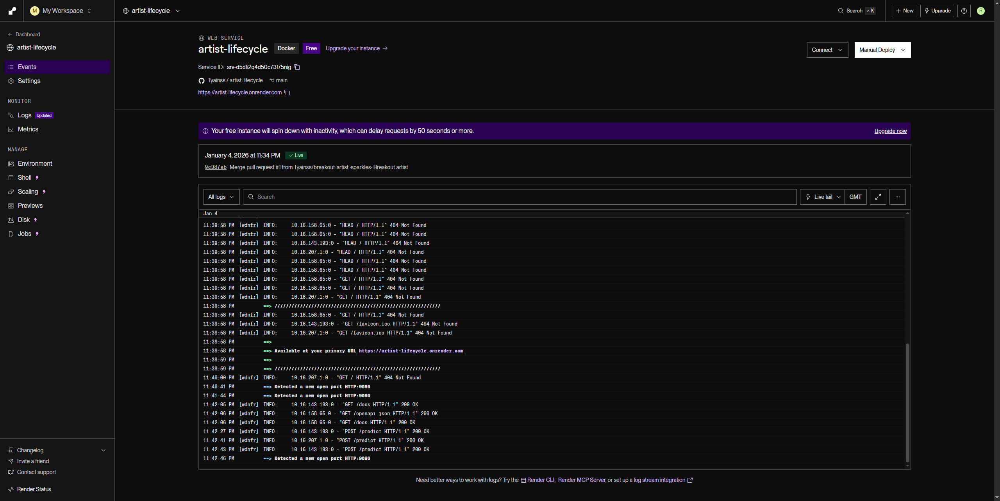

<div align="center">
  <div id="user-content-toc">
    <ul>
      <summary><h1 style="display: inline-block;">🚀 Breakout (Artist Lifecycle) 🚀</h1></summary>
    </ul>
  </div>
</div>

<br>
<hr>

Predict which artists are likely to **break out soon**, using **my listening history** from Last.fm, complemented with **Spotify metadata** (when available).

The project builds an **artist-month** dataset from scrobbles, trains a classifier, and serves predictions via a small FastAPI API.

## At a glance

- 🎯 **Goal**: Identify “breakout artists” based on my listening patterns.
- 🧠 **Models**:
  - XGBoost - **final production model**
  - Logistic Regression - explored but not selected
- 🧩 **Stack**: Python, scikit-learn, XGBoost, FastAPI, uv, Docker, Render
- 🗂 **Key outputs**:
  - Modeling dataset: `data/features/breakout_modeling.csv`
  - Trained model: `data/models/breakout/model.bin`
- 🗂 **Repo layout (key parts)**:
  - `core/build/` – snapshot + feature + modeling table builders
  - `core/modeling/train/` – training pipeline (writes `model.bin`)
  - `service/` – FastAPI service (`service/api.py`)
  - `notebooks/breakout/` – EDA + training notebook
  - `configs/` – project paths, sources, and breakout rules

---

## Quick start

If you just want to see it working locally:

- ✅ **Try the live API docs** (no setup):

  - Open: https://artist-lifecycle.onrender.com/docs

    Note: Render's free tier can spin down after inactivity, so it may take a bit of time to start working.

- ▶️ **Run the API locally** (requires Python 3.12 + `uv`):

  ```bash
  uv sync
  uv run uvicorn predict:app --host 0.0.0.0 --port 9696
  ```

* 📦 **Run with Docker**:

  ```bash
  docker build -t breakout-service .
  docker run -p 9696:9696 breakout-service

  ```

Then go to `http://localhost:9696/docs` and call `POST /predict` with sample data.

---

## 1. Problem & use case

I want to know if I can predict which new artists are going to become "core" part of my music listening habits, based on how I first listened to them, and based on other features from the artist's metadata.

### ML framing

This is a **binary classification** problem at the **artist-month** level:

* **Unit of analysis**: one row = `(artist_name, month=t)`
* **Target**: whether the artist becomes “core” soon (see label definition below)
* **Constraint**: the data is time-ordered, so splits must be time-based (no shuffling)

### How success is evaluated

Because true breakouts are rare, the main focus is:

* **PR-AUC** on validation (ranking quality under class imbalance)

Also tracked as supporting diagnostics:

* **ROC-AUC**
* thresholded results (precision/recall) under a controlled **alert volume** policy

---

## 2. Data & labels

### 2.1 Input data

Source file:

* `data/curated/scrobbles.csv` (1 row = 1 scrobble)

### 2.2 Core + breakout label

An artist-month is considered **core** if either:

* `plays_t >= 20`, or
* `share_t >= 0.01`

The breakout label uses a short horizon:

* `y(t)=1` if the artist becomes core in month `t+1` or `t+2` (horizon = 2 months)

Training rows are filtered by a “new/active” eligibility rule:

* active now: `plays_t >= 3`
* discovered recently: first seen within 6 months
* not already core recently (lookback = 3 months)
* plus a cold-start buffer of 6 months


---

## 3. Modeling & evaluation

### 3.1 Train / validation / test split

Split is time-based by month:

* 60% train / 20% validation / 20% test
* no shuffling
* tuning and threshold selection happen using **validation only**
* test is evaluated once at the end

### 3.2 Models & training methodology

Two models are compared:

* Logistic Regression (baseline)
* XGBoost (light tuning + early stopping)

### 3.3 Metrics & what they mean

* **PR-AUC**: the primary metric (better for rare positives)
* **ROC-AUC**: a supporting diagnostic
* **Thresholded evaluation**: precision/recall under a controlled alert volume

### 3.4 Logistic Regression vs XGBoost (validation)

| Model               | ROC-AUC | PR-AUC |
| ------------------- | :-----: | :----: |
| Logistic Regression |  0.8301 | 0.0325 |
| XGBoost             |  0.9097 | 0.0557 |

Validation (threshold selection):

* Logistic Regression threshold: `T=0.5694`
* XGBoost threshold: `T=0.5555`
* Winner: **XGBoost** (higher validation PR-AUC)

Test:

* prevalence: **10 positives out of 678 rows (1.48%)**
* **PR-AUC = 0.0736**
* **ROC-AUC = 0.8812**
* At threshold `T=0.5555`: alerts/month **min/median/max = 0 / 4 / 9**

---

## 4. Feature engineering

The modeling table is at the **artist-month** level. Features fall into a few simple groups:

### Listening volume & context

* `plays_t` - how many times I listened to the artist in month `t`.
* `share_t` - share of my total scrobbles that month that belong to the artist.
* `total_monthly_scrobbles` - my total scrobbles in month `t` (all artists).

### Discovery / lifecycle

* `months_since_first_seen` - how many months since the artist first appeared in my history.
* `is_first_month` - whether month `t` is the artist’s first month in my history.
* `active_months_count_before_t` - number of months before `t` where the artist had any activity.
* `cumulative_plays_before_t` - total plays before month `t`.

### Engagement patterns

* `days_active_t` - number of distinct days in month `t` where I listened to the artist.
* `plays_per_track_t` - average plays per track in month `t` (repeat-heavy vs more variety).
* `track_novelty_rate_t` - fraction of tracks in month `t` that were new for that artist (first-time listens).
* `last_play_gap_days_t` - days since I last listened to the artist (measured at month end).

### Momentum

* `plays_t_minus_1` - plays in the previous month.
* `plays_prev3_mean` - average plays over the previous 3 months.
* `delta_1m` - month-over-month change in plays (`plays_t - plays_t_minus_1`).
* `delta_1m_pct` - month-over-month percent change in plays.
* `ratio_to_prev3` - plays relative to recent baseline (`plays_t / plays_prev3_mean`).
* `trend_slope_3m` - short-term trend slope over the last 3 months.
* `share_delta_1m` - month-over-month change in `share_t`.
* `prev_month_plays_was_zero` - whether the artist had zero plays in the previous month.

---

## 5. Project structure

```text
artist-lifecycle/
├── common/
│   ├── config_manager.py
│   ├── io.py
│   └── logging.py
├── configs/
│   ├── breakout.yaml
│   ├── project.yaml
│   └── sources.yaml
├── core/
│   ├── build/
│   │   ├── build_breakout_modeling.py
│   │   ├── build_features.py
│   │   └── build_snapshots.py
│   ├── modeling/
│   │   └── train/
│   │       └── train_breakout.py
│   ├── scripts/
│   │   └── build_breakout.py
│   └── serving/
│       ├── artifacts.py
│       └── schemas.py
├── data/
│   ├── curated/
│   │   └── scrobbles.csv
│   ├── processed/
│   │   └── artist_month_snapshots.csv
│   ├── features/
│   │   ├── breakout_features.csv
│   │   ├── breakout_features_v1_reduced.csv
│   │   └── breakout_modeling.csv
│   ├── models/
│   │   └── breakout/
│   │       └── model.bin
│   └── metrics/
│       └── breakout/
│           └── metrics.json
├── notebooks/
│   └── breakout/
│       ├── 00_eda.ipynb
│       └── 01_model_training.ipynb
├── service/
│   └── api.py
├── Dockerfile
├── pyproject.toml
├── uv.lock
└── README.md
```

---

## 6. Environment & dependencies (uv)

### 6.1 Requirements

* Python **3.12+**
* `uv`

### 6.2 Install dependencies

```bash
uv sync --locked
```


---

## 7. Running the API locally

Start the server:

```bash
uv run uvicorn service.api:app --host 0.0.0.0 --port 9696
```

* API docs: `http://localhost:9696/docs`
* Health check: `http://localhost:9696/health`

### 7.1 Request / response format

`POST /predict` accepts:

* `records`: list of dicts (you typically pass rows from `breakout_features*.csv` / `breakout_modeling.csv`)
* `return_probabilities`: bool
* `threshold_override`: optional float

Example:

```bash
curl -X POST "http://localhost:9696/predict" \
  -H "Content-Type: application/json" \
  -d '{
    "records": [
      {
        "month": "2021-06-01",
        "artist_name": "Ichiko Aoba",
        "months_since_first_seen": 9,
        "is_first_month": 0,
        "plays_t": 14,
        "plays_per_track_t": 1.0,
        "days_active_t": 1,
        "last_play_gap_days_t": 9.04582175925926,
        "track_novelty_rate_t": 0.0,
        "share_t": 0.0040287769784172,
        "total_monthly_scrobbles": 3475,
        "plays_prev3_mean": 0.3333333333333333,
        "delta_1m": 14,
        "trend_slope_3m": 6.5,
        "active_months_count_before_t": 7
      }
    ],
    "return_probabilities": true,
    "threshold_override": null
  }'
```

---

## 8. Docker - build & run

The repository includes a **Dockerfile** that uses uv inside the container:

```dockerfile
FROM python:3.12-slim

# Install uv
COPY --from=ghcr.io/astral-sh/uv:latest /uv /uvx /bin/

WORKDIR /app

# Copy project metadata first
COPY pyproject.toml uv.lock ./

# Install deps according to lockfile
RUN uv sync --locked --no-cache

# Copy the full project (code + configs + model artifact)
COPY . .

EXPOSE 9696

CMD ["uv", "run", "uvicorn", "core.scripts.predict:app", "--host", "0.0.0.0", "--port", "9696"]
```

`.dockerignore` is configured to:

* Exclude `.git`, `.venv`, `venv`, caches, and large raw data folders.
* **Include** `core/data/models/` so `model.bin` is available in the image.

### 8.1 Build & run locally

From the project root:

```bash
uv sync
uv run uvicorn predict:app --host 0.0.0.0 --port 9696
```

Then open:

* `http://localhost:9696/` - health check.
* `http://localhost:9696/docs` - Swagger UI.

---

## 9. Cloud deployment - Render

The service is deployed on **Render** as a Docker-based web service.

* Live URL: **[https://artist-lifecycle.onrender.com](https://artist-lifecycle.onrender.com)**
* Docs UI: **[https://artist-lifecycle.onrender.com/docs](https://artist-lifecycle.onrender.com/docs)**

Render setup:

* Connect Render to the GitHub repository.
* Create a **Web Service** and configure it to use the root `Dockerfile`.
* Expose port `9696` in the container (already done in the Dockerfile).
* Health check path: `/`.
* Use a free instance type.

Render's free tier can spin down after inactivity, so the first request after a long idle period might be slow or briefly return a 502 while waking up.

This screenshot shows the fully working deployment on Render.


---